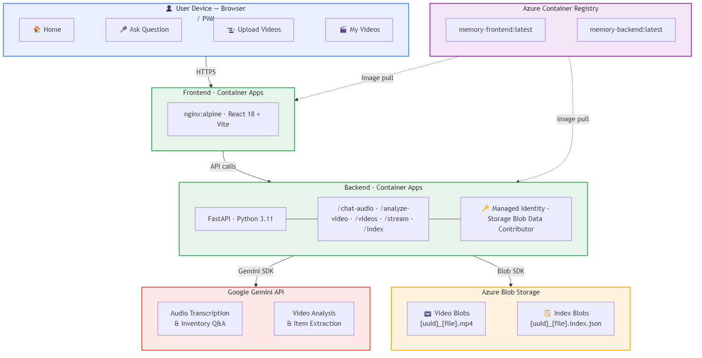

# Memory Assistant PWA

A Progressive Web App (PWA) that helps elderly users locate household items using voice queries. Users upload walkthrough videos of their home; Google Gemini analyses the videos to build an inventory index of objects and locations. Users can then ask voice questions to find their belongings, and the app plays the relevant video clip alongside the answer.

> **Troubleshooting**: See [docs/TROUBLESHOOTING.md](docs/TROUBLESHOOTING.md) for a guide to common errors and fixes encountered during development.

---

## Architecture



## Technical Details

### Frontend Components

| Component | Technology | Purpose |
|---|---|---|
| UI Framework | React 18 + TypeScript | Component-based SPA |
| Build Tool | Vite | Fast dev build + production bundle |
| PWA | vite-plugin-pwa + Workbox | Installable app, offline caching |
| Routing | React Router v6 | Client-side navigation |
| Home (`App.tsx`) | React | Nav hub, Admin Mode toggle (persisted in localStorage) |
| Ask Question (`Chat.tsx`) | React | MediaRecorder API, voice recording, message display + video clip player |
| Upload Videos (`Record.tsx`) | React | Multi-stage upload flow with Gemini analysis spinner |
| My Videos (`Videos.tsx`) | React | Video list, inline player, per-video inventory index editor |
| Web Speech API | Browser native | Text-to-speech readback of assistant answers |
| Container | nginx:alpine | Serves the static Vite build |
| Registry | Azure Container Registry | Stores `memory-frontend:latest` image |
| Hosting | Azure Container Apps | `<your-frontend-app>` |

### Backend Components

| Component | Technology | Purpose |
|---|---|---|
| API Framework | FastAPI (Python 3.11) | REST API, async request handling |
| AI | Google Gemini (`gemini-flash-lite-latest`) | Audio transcription + inventory Q&A; video item extraction |
| Storage SDK | `azure-storage-blob` | Upload, list, stream, delete blobs |
| Auth | `azure-identity` — `ManagedIdentityCredential` | Passwordless auth to Azure Storage (no connection strings) |
| RBAC Role | Storage Blob Data Contributor | Grants backend read/write on the blob container |
| Blob: Video | `{uuid}_{filename}` | Raw uploaded video file |
| Blob: Index | `{uuid}_{filename}.index.json` | AI-extracted item inventory (object, location, room, notes) |
| Video Streaming | HTTP Range requests (`206 Partial Content`) | Efficient in-browser video playback |
| Container | Python 3.11 slim | Runtime image |
| Registry | Azure Container Registry | Stores `memory-backend:latest` image |
| Hosting | Azure Container Apps | `<your-backend-app>` with System-Assigned Managed Identity |

### Backend API Endpoints

| Method | Path | Description |
|---|---|---|
| `POST` | `/chat-audio` | Accepts audio file; transcribes with Gemini; looks up inventory; returns answer + matched video name |
| `POST` | `/analyze-video` | Uploads video to blob storage; runs Gemini analysis; saves `.index.json` companion blob |
| `GET` | `/videos` | Lists all videos with size, last modified, and `has_index` flag |
| `GET` | `/videos/{name}/stream` | HTTP range-aware video streaming from blob storage |
| `GET` | `/videos/{name}/index` | Returns the inventory index JSON for a specific video |
| `PUT` | `/videos/{name}/index` | Overwrites the inventory index JSON (admin edit) |
| `DELETE` | `/videos/{name}` | Deletes the video blob and its companion `.index.json` |

### Azure Resources

| Resource | Name |
|---|---|
| Resource Group | `<your-resource-group>` |
| Container Registry | `<your-acr-name>` |
| Storage Account | `<your-storage-account>` |
| Blob Container | `user-videos` |
| Frontend App | `<your-frontend-app>` |
| Backend App | `<your-backend-app>` |
| Region | East US |

---

## Deployment

Three PowerShell scripts are provided:

| Script | Purpose |
|---|---|
| `deploy.ps1` | Full deploy — builds and deploys both frontend and backend |
| `deploy_frontend.ps1` | Frontend only |
| `deploy_backend.ps1` | Backend only |

```powershell
# Full deploy
./deploy.ps1

# Frontend only (e.g. after UI changes)
./deploy_frontend.ps1

# Backend only (e.g. after API changes)
./deploy_backend.ps1
```

**Prerequisites**: Azure CLI logged in (`az login`) with access to `<your-resource-group>`.

---

## Configuration

### Google Gemini API Key

1. Get your API key from [Google AI Studio](https://aistudio.google.com/).
2. Set it on the backend Container App:

```powershell
az containerapp update `
  --name <your-backend-app> `
  --resource-group <your-resource-group> `
  --set-env-vars GOOGLE_API_KEY=YOUR_KEY_HERE
```

> **Note**: The free tier of the Gemini API has a limit of ~20 requests/day. Enable billing in Google AI Studio for production use.

### Azure Storage Access

The backend uses **Managed Identity** — no connection strings required. Ensure the backend's System-Assigned identity has the **Storage Blob Data Contributor** role on the storage account, and that `publicNetworkAccess` is **Enabled** on the storage account.

---

## Usage

1. Enable **Admin Mode** on the home screen (toggle top-right).
2. Tap **Upload Videos** — select one or more walkthrough videos of your home.
3. The app uploads each video and runs AI analysis to extract an inventory of objects and their locations.
4. Tap **My Videos** to view, play, and edit the extracted inventory for each video.
5. Tap **Ask Question** — allow microphone access, then tap **Tap to Speak**.
6. Ask where something is (e.g. *"Where are my glasses?"*).
7. Tap **Stop & Send** — the app responds with the location and plays the relevant video clip.
