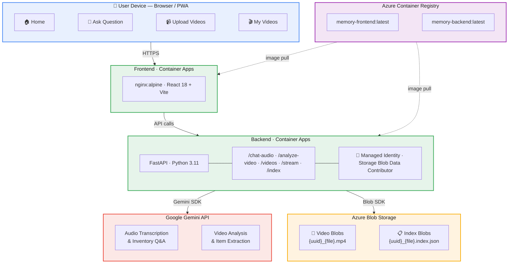

```mermaid
flowchart TD
    subgraph User["👤 User Device — Browser / PWA"]
        Home["🏠 Home"] ~~~ Chat["🎤 Ask Question"] ~~~ Upload["📹 Upload Videos"] ~~~ MyVids["🎬 My Videos"]
    end

    subgraph Frontend["Frontend · Container Apps"]
        NGINX["nginx:alpine · React 18 + Vite"]
    end

    subgraph Registry["Azure Container Registry"]
        IMG_FE["memory-frontend:latest"] ~~~ IMG_BE["memory-backend:latest"]
    end

    subgraph Backend["Backend · Container Apps"]
        FastAPI["FastAPI · Python 3.11"] --- Endpoints["/chat-audio · /analyze-video · /videos · /stream · /index"] --- Identity["🔑 Managed Identity · Storage Blob Data Contributor"]
    end

    subgraph Gemini["Google Gemini API"]
        G_Audio["Audio Transcription<br/>& Inventory Q&A"] ~~~ G_Video["Video Analysis<br/>& Item Extraction"]
    end

    subgraph Storage["Azure Blob Storage"]
        Videos["📼 Video Blobs<br/>{uuid}_{file}.mp4"] ~~~ Indexes["📋 Index Blobs<br/>{uuid}_{file}.index.json"]
    end

    User -->|HTTPS| Frontend
    Frontend -->|API calls| Backend
    Backend -->|Gemini SDK| Gemini
    Backend -->|Blob SDK| Storage
    Registry -.->|image pull| Frontend
    Registry -.->|image pull| Backend

    style User fill:#e8f0fe,stroke:#4285f4,stroke-width:2px,color:#1a1a1a
    style Frontend fill:#e6f4ea,stroke:#34a853,stroke-width:2px,color:#1a1a1a
    style Backend fill:#e6f4ea,stroke:#34a853,stroke-width:2px,color:#1a1a1a
    style Gemini fill:#fce8e6,stroke:#ea4335,stroke-width:2px,color:#1a1a1a
    style Storage fill:#fff3e0,stroke:#f9ab00,stroke-width:2px,color:#1a1a1a
    style Registry fill:#f3e5f5,stroke:#9c27b0,stroke-width:2px,color:#1a1a1a
```