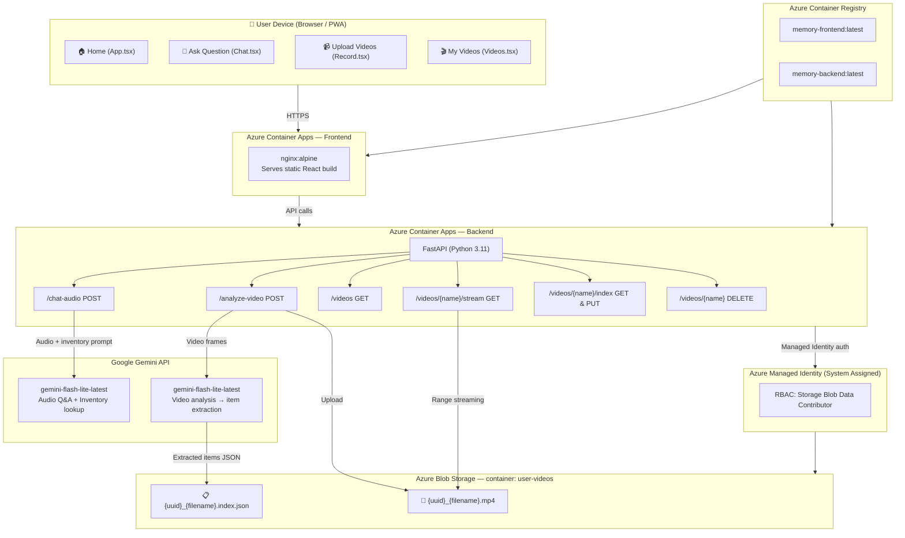

```mermaid
flowchart TB
    subgraph User["👤 User Device (Browser / PWA)"]
        direction TB
        UI_Home["🏠 Home (App.tsx)"]
        UI_Chat["🎤 Ask Question (Chat.tsx)"]
        UI_Record["📹 Upload Videos (Record.tsx)"]
        UI_Videos["🎬 My Videos (Videos.tsx)"]
    end

    subgraph ACA_Frontend["Azure Container Apps — Frontend"]
        NGINX["nginx:alpine\nServes static React build"]
    end

    subgraph ACA_Backend["Azure Container Apps — Backend"]
        FastAPI["FastAPI (Python 3.11)"]
        EP1["/chat-audio POST"]
        EP2["/analyze-video POST"]
        EP3["/videos GET"]
        EP4["/videos/{name}/stream GET"]
        EP5["/videos/{name}/index GET & PUT"]
        EP6["/videos/{name} DELETE"]
        FastAPI --> EP1 & EP2 & EP3 & EP4 & EP5 & EP6
    end

    subgraph ACR["Azure Container Registry"]
        IMG_FE["memory-frontend:latest"]
        IMG_BE["memory-backend:latest"]
    end

    subgraph Storage["Azure Blob Storage — container: user-videos"]
        BLOB_VID["📼 {uuid}_{filename}.mp4"]
        BLOB_IDX["📋 {uuid}_{filename}.index.json"]
    end

    subgraph ManagedID["Azure Managed Identity (System Assigned)"]
        RBAC["RBAC: Storage Blob Data Contributor"]
    end

    subgraph Gemini["Google Gemini API"]
        G1["gemini-flash-lite-latest\nAudio Q&A + Inventory lookup"]
        G2["gemini-flash-lite-latest\nVideo analysis → item extraction"]
    end

    User -->|HTTPS| ACA_Frontend
    ACA_Frontend -->|API calls| ACA_Backend
    ACR --> ACA_Frontend & ACA_Backend
    ACA_Backend -->|Managed Identity auth| ManagedID
    ManagedID --> Storage
    EP1 -->|Audio + inventory prompt| G1
    EP2 -->|Video frames| G2
    G2 -->|Extracted items JSON| BLOB_IDX
    EP4 -->|Range streaming| BLOB_VID
    EP2 -->|Upload| BLOB_VID
```

---